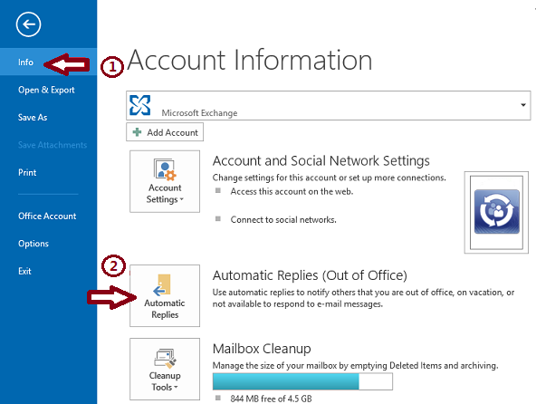

# SCSM Out of Office

If there is one thing that seems to pop up every now and then is the desire to prevent Work Item Assignment to individuals who are out of office. Just see these three seperate posts within the Cireson community, their timespan, and the slightly different nature of the requests as evidence:

- https://community.cireson.com/discussion/89/analyst-out-of-office-ooo-notifications-for-cireson-analyst-portal

- https://community.cireson.com/discussion/2662/analyst-availability-for-ticket-assignment

- https://community.cireson.com/discussion/comment/16174#Comment_16174

While this functionality is arguably a staple in other ticketing solutions, it's one missing in the CMDB solution that is Microsoft Service Manager. It's solution comes in three parts.

1. A management pack to Extend your User Class with OOO properties (AdhocAdam.System.Domain.User.OOOExtension.mp)
2. A management pack that contains workflows to prevent Work Item assignment when users have their OutOfOffice property set to true (AdhocAdam.WorkItemAssignmentPrevention.OOO.mp)
3. (optional) A PowerShell script so you can sync these properties out of Exchange and write them into Service Manager. In doing so, no additional training needs to be done within your organization around preventing Work Item assignment. Simply set your OOO with Outlook and enjoy your time off! (Set-SCSMUserOOO.ps1)

**UNDER NO CIRCUMSTANCES SHOULD YOU IMPORT THE UNSEALED XMLs (with the exception of the override XMLs). YOU SHOULD HOWEVER PERFORM ONE OF THE FOLLOWING THREE OPTIONS...**
- Download the source and then sign with your own key
- Download the source and sign with the included key
- Download the latest [release](https://github.com/AdhocAdam/scsmoutofoffice/releases) if you prefer not to deal with signing

**Installation instructions**
1. Install the class extension MP (AdhocAdam.System.Domain.User.OOOExtension.mp) for the User Class that adds 3 Out of Office properties to users and groups within SCSM. These properties are OutOfOffice, OutOfOfficeStartDate, OutOfOfficeEndDate.
2. Import the MP for preventing Work Item assignment, by default all of the Workflows are Disabled (AdhocAdam.WorkItemAssignmentPrevention.OOO.mp)
3. Copy the *.DLLs to the Service Manager installation directory on your Workflow server
4. Import the XMLs for each workflow you'd like to Enable
5. Restart the Microsoft Monitoring Agent (HealthService) on your Workflow server
6. (optional) Use the included PowerShell script to sync OOO information from Exchange into SCSM and it's respective users